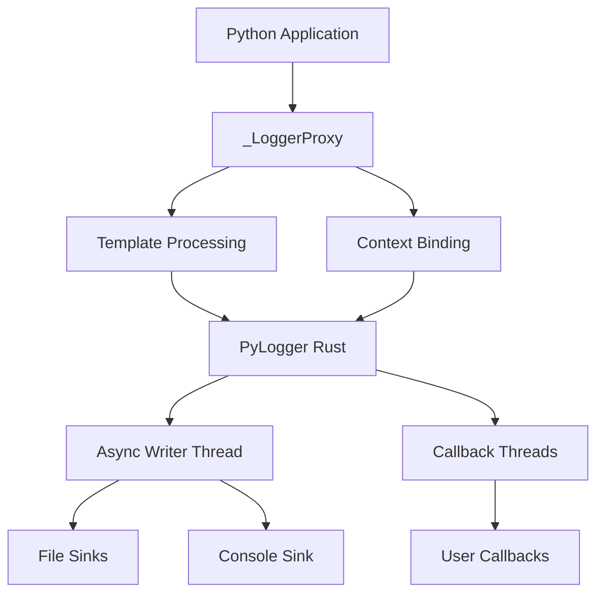

# Logl[](https://pypi.org/project/logly/)
[](https://pypistats.org/packages/logly)
[](https://www.python.org/)
[](https://github.com/muhammad-fiaz/logly)
<div align="center">
  
  <p><em>Rust-powered, Loguru-like logging for Python</em></p>

  [](https://pypi.org/project/logly/)
  [](https://pypistats.org/packages/logly)
  [](https://www.python.org/)
  [](https://github.com/muhammad-fiaz/logly)
</div>

---

## Overview

**Logly** is a high-performance logging library for Python that combines the familiarity of Python's standard logging API with the speed and safety of Rust. Built with **tracing** and **PyO3**, Logly delivers efficient, reliable logging for applications that generate large volumes of log messages.

### Key Features

- 🚀 **Blazing Fast** - Rust-powered backend with async I/O
- 🎨 **Beautiful Output** - Colored console logs with JSON support
- 📁 **Smart Rotation** - Time and size-based file rotation
- 🔄 **Async Callbacks** - Zero-blocking event handlers
- 📝 **Template Strings** - `{variable}` syntax with deferred evaluation
- 🎯 **Context Binding** - Persistent and temporary context fields
- 🛡️ **Type Safe** - Full type stubs for IDE support
- ⚡ **Zero Dependencies** - Single wheel, no external requirements

---

## Why Logly?

### Performance

Logly outperforms traditional Python logging libraries by leveraging Rust's performance:

```python
# 50,000 log messages
Standard Logging: ~2.5s
Logly:           ~0.8s  (3x faster)

# Concurrent logging (4 threads × 25,000 messages)
Standard Logging: ~5.2s
Logly:           ~1.6s  (3.2x faster)
```

### Developer Experience

```python
from logly import logger

# Simple and intuitive
logger.info("User {user} logged in", user="alice", ip="192.168.1.1")

# Powerful context management
request_logger = logger.bind(request_id="r-123")
request_logger.info("Processing request")

# Async callbacks for real-time monitoring
logger.add_callback(lambda rec: send_alert(rec) if rec['level'] == 'ERROR' else None)
```

---

## Quick Start

### Installation

```bash
pip install logly
```

### Basic Usage

```python
from logly import logger

# Configure
logger.configure(level="INFO", json=False, color=True)

# Add outputs
logger.add("console")
logger.add("logs/app.log", rotation="daily", retention=7)

# Log messages
logger.info("Application started", version="1.0.0")
logger.error("Failed to connect", retry_count=3)

# Cleanup
logger.complete()
```

---

## Core Concepts

### 1. Multiple Sinks

Route logs to different destinations with independent configurations:

```python
# Console for development
logger.add("console")

# Daily rotated files for production
logger.add("logs/app.log", rotation="daily", retention=30)

# Errors to separate file
logger.add("logs/errors.log", filter_min_level="ERROR")
```

### 2. Structured Logging

Automatically capture structured data:

```python
# Text mode: "User logged in user=alice ip=192.168.1.1"
logger.info("User logged in", user="alice", ip="192.168.1.1")

# JSON mode: {"timestamp": "...", "level": "INFO", "message": "...", "fields": {...}}
logger.configure(json=True)
logger.info("User logged in", user="alice", ip="192.168.1.1")
```

### 3. Context Management

Bind persistent context to log messages:

```python
# Create context logger
request_logger = logger.bind(request_id="r-123", user="alice")

# All logs include context
request_logger.info("Request started")  # Includes request_id and user
request_logger.error("Request failed")  # Context preserved

# Temporary context
with request_logger.contextualize(step="validation"):
    request_logger.debug("Validating input")  # Includes step field
```

### 4. Async Callbacks

React to log events in real-time without blocking:

```python
def alert_on_critical(record):
    if record.get("level") == "CRITICAL":
        send_notification(f"Critical error: {record['message']}")

callback_id = logger.add_callback(alert_on_critical)

# Callbacks execute in background threads
logger.critical("System out of memory")  # Alert sent asynchronously
```

### 5. Template Strings

Deferred evaluation for better performance:

```python
# Variables only evaluated if log level passes filter
logger.debug("Processing {item} with {config}", item=data, config=settings)

# Works with all string formats
user = "bob"
logger.info(f"User {user} action", action="login")  # f-string
logger.info("Item %d of %d", current, total)        # % format
```

---

## Architecture



### Components

- **_LoggerProxy** - Python wrapper with context and template support
- **PyLogger** - Rust core with tracing backend
- **Async Writer** - Background thread for non-blocking file I/O
- **Callback System** - Thread pool for async event handlers
- **Sink Management** - Multiple output destinations with filters

---

## Use Cases

### Web Applications

```python
from logly import logger
from fastapi import FastAPI, Request

app = FastAPI()
logger.add("console")
logger.add("logs/api.log", rotation="daily", retention=7)

@app.middleware("http")
async def log_requests(request: Request, call_next):
    request_logger = logger.bind(
        request_id=request.headers.get("X-Request-ID"),
        method=request.method,
        path=request.url.path
    )
    
    request_logger.info("Request received")
    response = await call_next(request)
    request_logger.info("Response sent", status_code=response.status_code)
    
    return response
```

### Data Processing Pipelines

```python
from logly import logger

logger.configure(json=True)
logger.add("logs/pipeline.log", size_limit="100MB", retention=10)

pipeline_logger = logger.bind(job_id="job-123", pipeline="etl")

for batch in process_data():
    with pipeline_logger.contextualize(batch_id=batch.id):
        pipeline_logger.info("Processing batch", records=len(batch))
        try:
            transform(batch)
            load(batch)
            pipeline_logger.success("Batch complete", duration=batch.elapsed)
        except Exception as e:
            pipeline_logger.exception("Batch failed")
```

### Monitoring and Alerting

```python
from logly import logger
import requests

def forward_to_monitoring(record):
    """Forward logs to external monitoring system"""
    if record.get("level") in ["ERROR", "CRITICAL"]:
        requests.post("https://monitoring.example.com/logs", json=record)

logger.add_callback(forward_to_monitoring)

# All errors automatically forwarded
logger.error("Database connection lost", retry_count=3)
logger.critical("Service unresponsive")
```

---

## Comparison

| Feature | Logly | Standard Logging | Loguru |
|---------|-------|------------------|--------|
| Performance | ⚡ Rust-powered | 🐌 Pure Python | 🐌 Pure Python |
| Async I/O | ✅ | ❌ | ❌ |
| Callbacks | ✅ Async | ❌ | ❌ |
| Template Strings | ✅ | ❌ | ❌ |
| Context Binding | ✅ | ⚠️ Limited | ✅ |
| JSON Output | ✅ | ⚠️ Manual | ✅ |
| Type Stubs | ✅ | ✅ | ⚠️ Partial |
| Rotation | ✅ Time + Size | ⚠️ Time only | ✅ Time + Size |
| Installation | 📦 Single wheel | 🐍 Built-in | 📦 Pure Python |

---

## What's Next?

<div class="grid cards" markdown>

-   :material-rocket-launch:{ .lg .middle } **Quick Start**

    ---

    Get up and running in 5 minutes

    [:octicons-arrow-right-24: Quick Start Guide](quickstart.md)

-   :material-api:{ .lg .middle } **API Reference**

    ---

    Complete documentation of all methods

    [:octicons-arrow-right-24: API Reference](api-reference/index.md)

-   :material-history:{ .lg .middle } **Changelog**

    ---

    See what's new in each version

    [:octicons-arrow-right-24: View Changelog](changelog.md)

-   :material-download:{ .lg .middle } **Installation**

    ---

    Install Logly with pip, uv, or poetry

    [:octicons-arrow-right-24: Installation Guide](installation.md)

</div>

---

## Community

- 🐛 [Report Issues](https://github.com/muhammad-fiaz/logly/issues)
- 💡 [Feature Requests](https://github.com/muhammad-fiaz/logly/discussions)
- 📖 [Contributing Guide](https://github.com/muhammad-fiaz/logly/blob/main/CONTRIBUTING.md)
- ⭐ [Star on GitHub](https://github.com/muhammad-fiaz/logly)

---

## License

Logly is licensed under the [MIT License](https://github.com/muhammad-fiaz/logly/blob/main/LICENSE).
