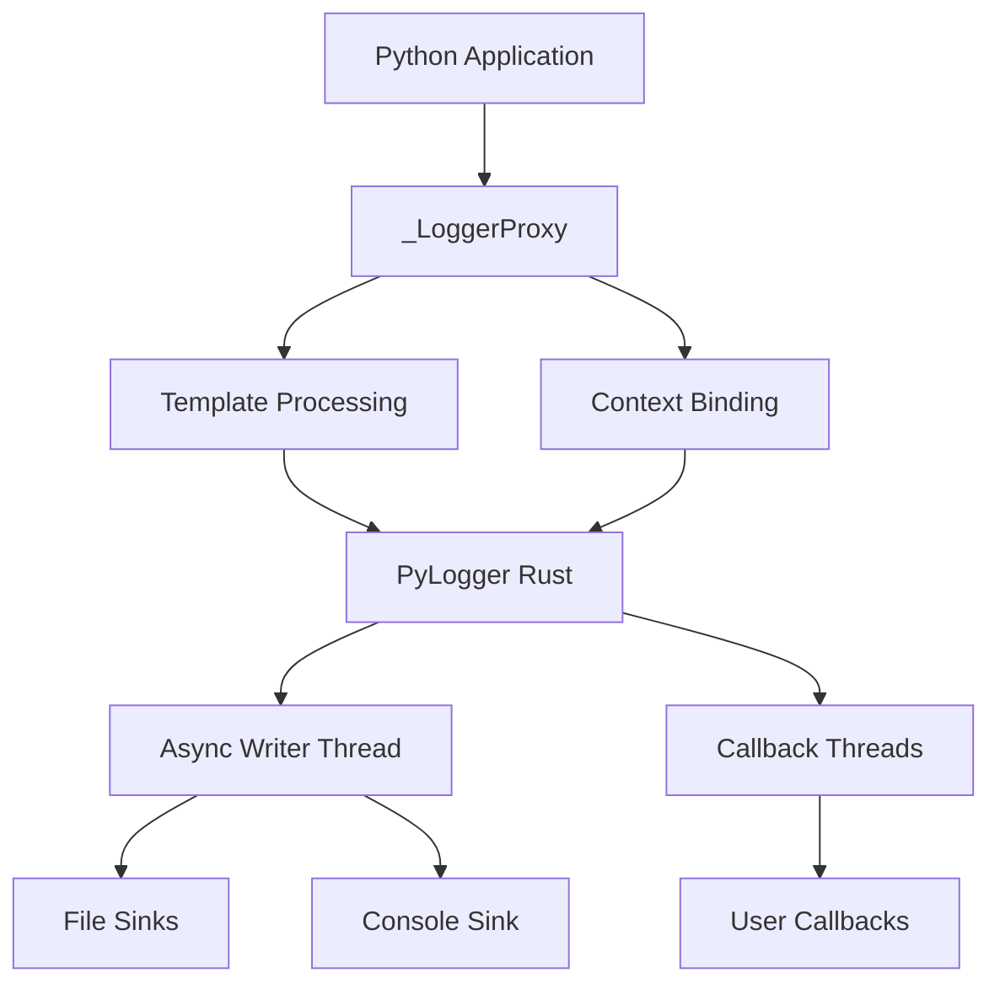

<div align="center">
<h1>Logly</h1>

  
  <p><em>Rust-powered, Loguru-like logging for Python</em></p>

  <a href="https://pypi.org/project/logly/"></a>
  <a href="https://pypistats.org/packages/logly"></a>
  <a href="https://www.python.org/"></a>
  <a href="https://github.com/muhammad-fiaz/logly"></a>
</div>

---

## Overview

**Logly** is a high-performance, enterprise-grade logging library for Python, powered by Rust. It combines the familiar Loguru-like API with blazing-fast performance, structured JSON logging, and production-ready features like async buffering, file rotation, and multi-sink architecture.

Built with a modular Rust backend using PyO3/Maturin, Logly delivers exceptional performance while maintaining memory safety and thread safety. The codebase is organized into focused modules (backend, config, format, utils) for maintainability and extensibility.

!!! note "Active Development"
    Logly is actively developed and optimized. Performance continues to improve with each release. For the best experience, use the latest version.

### Key Features

- 🚀 **High Performance**: Rust-powered backend with async buffering and optimized data structures
- 📦 **Modular Architecture**: Clean separation of concerns with backend, config, format, and utils modules
- 🔄 **Async Logging**: Background thread writing with configurable buffers and flush intervals
- 📋 **Structured JSON**: Full JSON logging support with custom fields and pretty printing
- 🎛️ **Per-Level Controls**: Fine-grained control over console output, timestamps, colors, and file storage per log level
- 🔧 **Granular Configuration**: Per-level console, time, color, and storage controls for maximum flexibility
- � **File Rotation**: Time-based and size-based rotation with retention policies
- �️ **Compression**: Built-in support for gzip and zstd compression
- 🎯 **Multi-Sink**: Multiple output destinations with per-sink filtering
- � **Rich Filtering**: Filter by log level, module, function, or custom criteria
- 📞 **Callbacks**: Custom processing functions with async execution
- � **Template Strings**: Dynamic log formatting with variable interpolation
- 🛡️ **Memory Safe**: Zero-cost abstractions and proper error handling
- 🧵 **Thread Safe**: Lock-free operations where possible, parking_lot for performance

---

## Architecture

Logly's architecture is designed for high performance, maintainability, and extensibility:

### 🏗️ **Modular Rust Backend**
```
src/
├── backend/          # Core logging functionality
│   ├── logging.rs    # Main logging logic with JSON/text formatting
│   ├── async.rs      # Asynchronous buffered writing
│   └── file.rs       # File appenders with rotation
├── config/           # Configuration and state management
│   └── state.rs      # Global state with thread-safe structures
├── format/           # Output formatting utilities
│   └── json.rs       # JSON record serialization
└── utils/            # Shared utilities and types
    └── levels.rs     # Log levels and rotation policies
```

### 🔧 **Key Components**

- **Backend Module**: Handles core logging operations, message formatting, and output dispatching
- **Config Module**: Manages global logger state, sink configurations, and thread-safe data structures
- **Format Module**: Provides JSON serialization and record formatting utilities
- **Utils Module**: Contains shared types, log levels, and rotation policies

### 🚀 **Performance Optimizations**

- **Async Buffering**: Background thread writing with configurable flush intervals
- **Memory Safety**: Zero-cost abstractions with proper error handling
- **Thread Safety**: Lock-free operations where possible, parking_lot Mutex for performance
- **Fast Hashing**: ahash for high-performance hash operations
- **Efficient Data Structures**: Crossbeam channels, Arc pointers, and optimized collections

---

## Why Logly?

### Performance

Logly outperforms traditional Python logging libraries by leveraging Rust's performance:

```python
# 50,000 log messages
Standard Logging: ~2.5s
Logly:           ~0.8s  (3x faster)

# Concurrent logging (4 threads × 25,000 messages)
Standard Logging: ~5.2s
Logly:           ~1.6s  (3.2x faster)
```

### Developer Experience

```python
from logly import logger

# Simple and intuitive
logger.info("User {user} logged in", user="alice", ip="192.168.1.1")

# Powerful context management
request_logger = logger.bind(request_id="r-123")
request_logger.info("Processing request")

# Async callbacks for real-time monitoring
logger.add_callback(lambda rec: send_alert(rec) if rec['level'] == 'ERROR' else None)
```

---

## Quick Start

### Installation

```bash
pip install logly
```

### Basic Usage

```python
from logly import logger

# Configure
logger.configure(level="INFO", json=False, color=True)

# Add outputs
logger.add("console")
logger.add("logs/app.log", rotation="daily", retention=7)

# Log messages
logger.info("Application started", version="1.0.0")
logger.error("Failed to connect", retry_count=3)

# Cleanup
logger.complete()
```

---

## Core Concepts

### 1. Multiple Sinks

Route logs to different destinations with independent configurations:

```python
# Console for development
logger.add("console")

# Daily rotated files for production
logger.add("logs/app.log", rotation="daily", retention=30)

# Errors to separate file
logger.add("logs/errors.log", filter_min_level="ERROR")
```

### 2. Structured Logging

Automatically capture structured data:

```python
# Text mode: "User logged in user=alice ip=192.168.1.1"
logger.info("User logged in", user="alice", ip="192.168.1.1")

# JSON mode: {"timestamp": "...", "level": "INFO", "message": "...", "fields": {...}}
logger.configure(json=True)
logger.info("User logged in", user="alice", ip="192.168.1.1")
```

### 3. Context Management

Bind persistent context to log messages:

```python
# Create context logger
request_logger = logger.bind(request_id="r-123", user="alice")

# All logs include context
request_logger.info("Request started")  # Includes request_id and user
request_logger.error("Request failed")  # Context preserved

# Temporary context
with request_logger.contextualize(step="validation"):
    request_logger.debug("Validating input")  # Includes step field
```

### 4. Async Callbacks

React to log events in real-time without blocking:

```python
def alert_on_critical(record):
    if record.get("level") == "CRITICAL":
        send_notification(f"Critical error: {record['message']}")

callback_id = logger.add_callback(alert_on_critical)

# Callbacks execute in background threads
logger.critical("System out of memory")  # Alert sent asynchronously
```

### 5. Template Strings

Deferred evaluation for better performance:

```python
# Variables only evaluated if log level passes filter
logger.debug("Processing {item} with {config}", item=data, config=settings)

# Works with all string formats
user = "bob"
logger.info(f"User {user} action", action="login")  # f-string
logger.info("Item %d of %d", current, total)        # % format
```

---

## Architecture



### Components

- **_LoggerProxy** - Python wrapper with context and template support
- **PyLogger** - Rust core with tracing backend
- **Async Writer** - Background thread for non-blocking file I/O
- **Callback System** - Thread pool for async event handlers
- **Sink Management** - Multiple output destinations with filters

---

## Use Cases

### Web Applications

```python
from logly import logger
from fastapi import FastAPI, Request

app = FastAPI()
logger.add("console")
logger.add("logs/api.log", rotation="daily", retention=7)

@app.middleware("http")
async def log_requests(request: Request, call_next):
    request_logger = logger.bind(
        request_id=request.headers.get("X-Request-ID"),
        method=request.method,
        path=request.url.path
    )
    
    request_logger.info("Request received")
    response = await call_next(request)
    request_logger.info("Response sent", status_code=response.status_code)
    
    return response
```

### Data Processing Pipelines

```python
from logly import logger

logger.configure(json=True)
logger.add("logs/pipeline.log", size_limit="100MB", retention=10)

pipeline_logger = logger.bind(job_id="job-123", pipeline="etl")

for batch in process_data():
    with pipeline_logger.contextualize(batch_id=batch.id):
        pipeline_logger.info("Processing batch", records=len(batch))
        try:
            transform(batch)
            load(batch)
            pipeline_logger.success("Batch complete", duration=batch.elapsed)
        except Exception as e:
            pipeline_logger.exception("Batch failed")
```

### Monitoring and Alerting

```python
from logly import logger
import requests

def forward_to_monitoring(record):
    """Forward logs to external monitoring system"""
    if record.get("level") in ["ERROR", "CRITICAL"]:
        requests.post("https://monitoring.example.com/logs", json=record)

logger.add_callback(forward_to_monitoring)

# All errors automatically forwarded
logger.error("Database connection lost", retry_count=3)
logger.critical("Service unresponsive")
```

---

## Comparison

| Feature | Logly | Standard Logging | Loguru |
|---------|-------|------------------|--------|
| Performance | ⚡ Rust-powered | 🐌 Pure Python | 🐌 Pure Python |
| Async I/O | ✅ | ❌ | ❌ |
| Callbacks | ✅ Async | ❌ | ❌ |
| Template Strings | ✅ | ❌ | ❌ |
| Context Binding | ✅ | ⚠️ Limited | ✅ |
| JSON Output | ✅ | ⚠️ Manual | ✅ |
| Type Stubs | ✅ | ✅ | ⚠️ Partial |
| Rotation | ✅ Time + Size | ⚠️ Time only | ✅ Time + Size |
| Installation | 📦 Single wheel | 🐍 Built-in | 📦 Pure Python |

---

## 🚀 Quick Start

Get up and running in 5 minutes

[Quick Start Guide](quickstart.md)

## 📚 API Reference

Complete documentation of all methods

[API Reference](api-reference/index.md)

## 📝 Changelog

See what's new in each version

[View Changelog](changelog.md)

## ⬇️ Installation

Install Logly with pip, uv, or poetry

[Installation Guide](installation.md)

---

## Community

- 🐛 [Report Issues](https://github.com/muhammad-fiaz/logly/issues)
- 💡 [Feature Requests](https://github.com/muhammad-fiaz/logly/discussions)
- 📖 [Contributing Guide](https://github.com/muhammad-fiaz/logly/blob/main/CONTRIBUTING.md)
- ⭐ [Star on GitHub](https://github.com/muhammad-fiaz/logly)

---

## License

Logly is licensed under the [MIT License](https://github.com/muhammad-fiaz/logly/blob/main/LICENSE).
