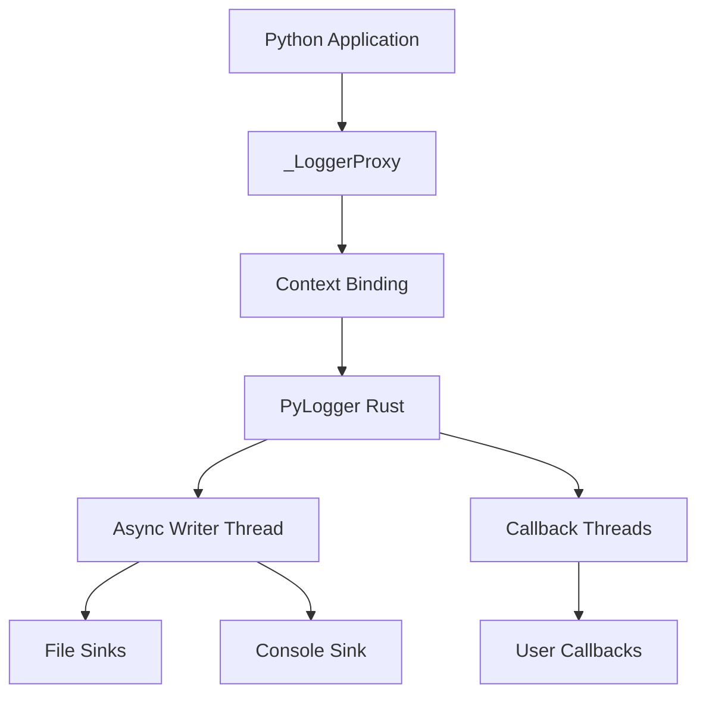

<div align="center">

  
  <p><em>Rust-powered, Loguru-like logging for Python</em></p>

  <a href="https://pypi.org/project/logly/"></a>
  <a href="https://pypistats.org/packages/logly"></a>
  <a href="https://www.python.org/"></a>
  <a href="https://github.com/muhammad-fiaz/logly"></a>
</div>

---

## Overview

**Logly** is a high-performance logging library for Python, powered by Rust. It combines the familiar Loguru-like API with the performance and safety guarantees of Rust.

Built with a modular Rust backend using PyO3/Maturin, Logly provides fast logging while maintaining memory safety and thread safety through Rust's ownership system.

!!! warning "Active Development"
    Logly is actively developed. Performance continues to improve with each release.

### 🎯 Why Logly?

Logly combines the simplicity of Python with the performance and safety of Rust, providing:

- **High Performance**: Rust-powered backend with optimized data structures
- **Memory Safety**: No data races, guaranteed thread safety
- **Comprehensive Solution**: Full-featured logging with async, rotation, filtering, and callbacks
- **Developer Friendly**: Intuitive API inspired by Loguru

### ✨ Key Features

- 🚀 **Rust-Powered Backend**: High-performance logging with async buffering
- 📦 **Modular Architecture**: Clean separation (backend, config, format, utils)
- 🔄 **Async Logging**: Background thread writing with configurable buffering
- 📋 **Structured JSON**: Native JSON support with custom fields and pretty printing
- 🎛️ **Per-Level Controls**: Fine-grained control over console output, timestamps, colors, and storage
- 🔧 **Smart Rotation**: Time-based (daily/hourly/minutely) and size-based rotation
- 🗜️ **Compression**: Built-in gzip and zstd compression for rotated files
- 🎯 **Multi-Sink**: Multiple outputs with independent filtering and formatting
- 🔍 **Rich Filtering**: Filter by level, module, or function name
- 📞 **Callbacks**: Custom log processing with async execution, color styling, and filename/line number tracking
- 🛡️ **Memory Safe**: Rust's ownership system prevents data races
- 🧵 **Thread Safe**: Lock-free operations with optimized synchronization

---

## Quick Start

### Installation

```bash
pip install logly
```

### Basic Usage

```python
from logly import logger

# Configure
logger.configure(level="INFO", json=False, color=True)

# Add outputs
logger.add("console")
logger.add("logs/app.log", rotation="daily", retention=7)

# Log messages
logger.info("Application started", version="1.0.0")
logger.error("Failed to connect", retry_count=3)

# Cleanup
logger.complete()
```

---

## Core Concepts

### 1. Multiple Sinks

Route logs to different destinations with independent configurations:

```python
# Console for development
logger.add("console")

# Daily rotated files for production
logger.add("logs/app.log", rotation="daily", retention=30)

# Errors to separate file
logger.add("logs/errors.log", filter_min_level="ERROR")
```

### 2. Structured Logging

Automatically capture structured data:

```python
# Text mode: "User logged in user=alice ip=192.168.1.1"
logger.info("User logged in", user="alice", ip="192.168.1.1")

# JSON mode: {"timestamp": "...", "level": "INFO", "message": "...", "fields": {...}}
logger.configure(json=True)
logger.info("User logged in", user="alice", ip="192.168.1.1")
```

### 3. Context Management

Bind persistent context to log messages:

```python
# Create context logger
request_logger = logger.bind(request_id="r-123", user="alice")

# All logs include context
request_logger.info("Request started")  # Includes request_id and user
request_logger.error("Request failed")  # Context preserved

# Temporary context
with request_logger.contextualize(step="validation"):
    request_logger.debug("Validating input")  # Includes step field
```

### 4. Async Callbacks

React to log events in real-time without blocking:

```python
def alert_on_critical(record):
    if record.get("level") == "CRITICAL":
        send_notification(f"Critical error: {record['message']}")

callback_id = logger.add_callback(alert_on_critical)

# Callbacks execute in background threads
logger.critical("System out of memory")  # Alert sent asynchronously
```

---

## Architecture



### Components

- **_LoggerProxy** - Python wrapper with context binding support
- **PyLogger** - Rust core with tracing backend
- **Async Writer** - Background thread for non-blocking file I/O
- **Callback System** - Thread pool for async event handlers
- **Sink Management** - Multiple output destinations with filters

---

## Use Cases

### Web Applications

```python
from logly import logger
from fastapi import FastAPI, Request

app = FastAPI()
logger.add("console")
logger.add("logs/api.log", rotation="daily", retention=7)

@app.middleware("http")
async def log_requests(request: Request, call_next):
    request_logger = logger.bind(
        request_id=request.headers.get("X-Request-ID"),
        method=request.method,
        path=request.url.path
    )
    
    request_logger.info("Request received")
    response = await call_next(request)
    request_logger.info("Response sent", status_code=response.status_code)
    
    return response
```

### Data Processing Pipelines

```python
from logly import logger

logger.configure(json=True)
logger.add("logs/pipeline.log", size_limit="100MB", retention=10)

pipeline_logger = logger.bind(job_id="job-123", pipeline="etl")

for batch in process_data():
    with pipeline_logger.contextualize(batch_id=batch.id):
        pipeline_logger.info("Processing batch", records=len(batch))
        try:
            transform(batch)
            load(batch)
            pipeline_logger.success("Batch complete", duration=batch.elapsed)
        except Exception as e:
            pipeline_logger.exception("Batch failed")
```

### Monitoring and Alerting

```python
from logly import logger
import requests

def forward_to_monitoring(record):
    """Forward logs to external monitoring system"""
    if record.get("level") in ["ERROR", "CRITICAL"]:
        requests.post("https://monitoring.example.com/logs", json=record)

logger.add_callback(forward_to_monitoring)

# All errors automatically forwarded
logger.error("Database connection lost", retry_count=3)
logger.critical("Service unresponsive")
```


---

## 🚀 Quick Start

Get up and running in 5 minutes

[Quick Start Guide](quickstart.md)

## 📚 API Reference

Complete documentation of all methods

[API Reference](api-reference/index.md)

## 📝 Changelog

See what's new in each version

[View Changelog](changelog.md)

## ⬇️ Installation

Install Logly with pip, uv, or poetry

[Installation Guide](installation.md)

---

## Community

- 🐛 [Report Issues](https://github.com/muhammad-fiaz/logly/issues)
- 💡 [Feature Requests](https://github.com/muhammad-fiaz/logly/discussions)
- 📖 [Contributing Guide](https://github.com/muhammad-fiaz/logly/blob/main/CONTRIBUTING.md)
- ⭐ [Star on GitHub](https://github.com/muhammad-fiaz/logly)

---

## License

Logly is licensed under the [MIT License](https://github.com/muhammad-fiaz/logly/blob/main/LICENSE).
